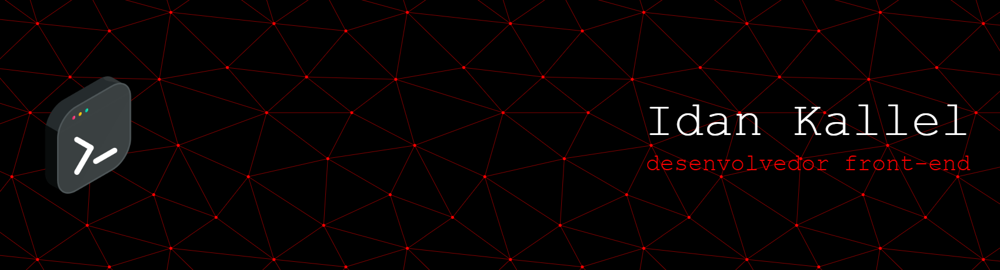

# Seja bem-vindo(a) ao meu GitHub! 😴👒                
Coding away here... watch out for the <> along the way.

Atualmente cursando 2° semestre de Ciência da Computação e busco me especializar em front-end. Ligeiramente obcecado em One Piece.

 

  

# Linguagens utilizadas

      
